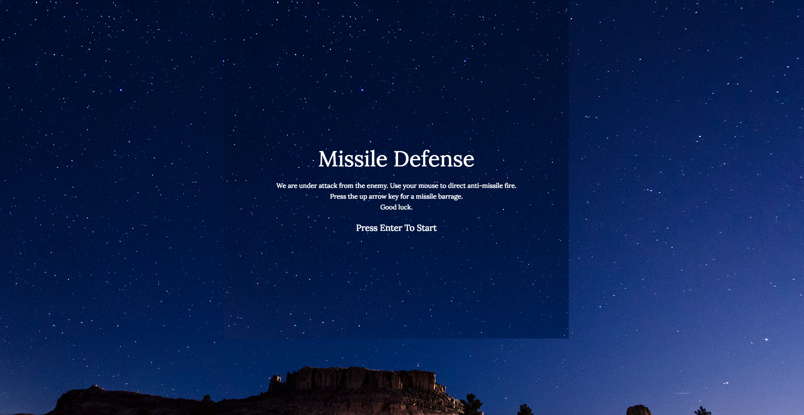
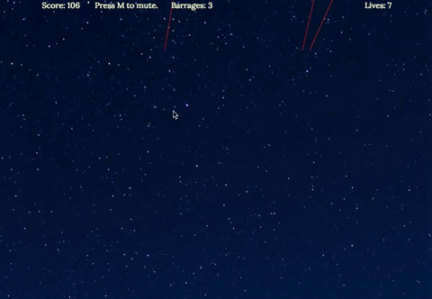
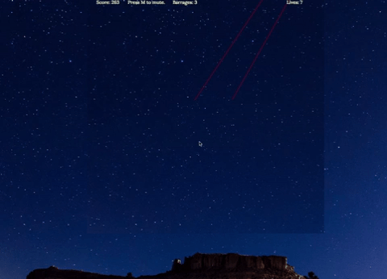

# MissileDefense

Missile Defense is a game modeled after missile command, an Atari game. Defend your city against incoming missiles, or perish. In addition to the normal defensive missile mechanics, players will have the option of unleashing a missile barrage, which will shoot up a barrage of missiles that will clear the incoming missiles.

[Missile Defense](https://jfeng702.github.io/MissileDefense/)

## Features

+ Incoming rockets that decrement lives upon contact with the ground.

+ Mouse feedback to shoot defensive missiles which will take out incoming missiles upon collision.
+ A missile barrage ability that will wipe out incoming missiles.

+ Score counter based upon time spend in game.
+ Techno music soundtrack

## Technologies Used
+ Vanilla Javascript for overall structure
+ HTML Canvas for DOM manipulation

**Future Improvements**
+ Sound effects for missile launches and collisions
+ Additional weapons/abilities
