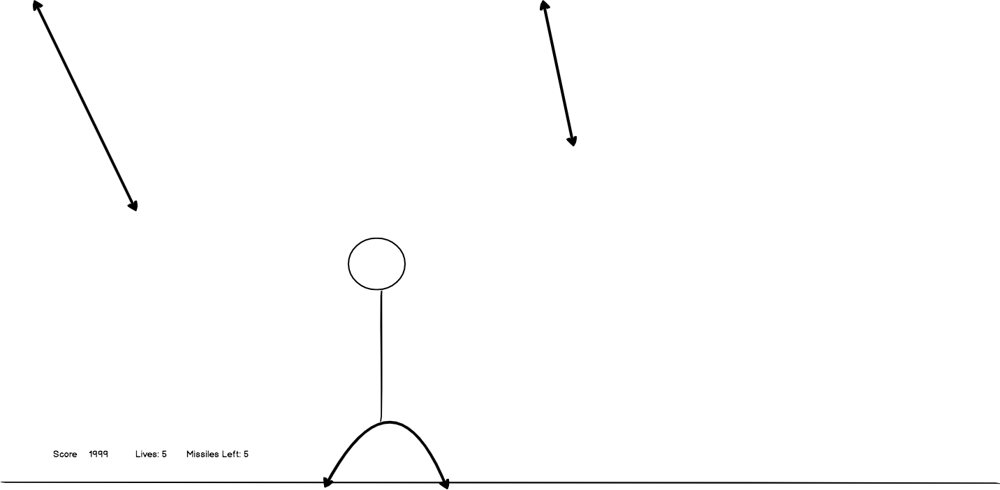

# MissileDefense

Missile Defense is a game modeled after missile command, an Atari game. Defend your city against incoming missiles, or perish. In addition to the normal defensive missile mechanics, players will have the option of unleashing a missile barrage, which will shoot up a barrage of missiles that will clear the incoming missiles.

[Missile Defense](https://jfeng702.github.io/MissileDefense/)

## Functionality & MVP
Missile Defense will have:
+ Incoming rockets that decrement lives upon contact with the ground.
+ Mouse feedback that will shoot defensive missiles that take out incoming missiles upon collision.
+ A missile barrage ability that will wipe out incoming missiles.
+ Score counter based upon time spend in game.

## Technologies Used
+ Vanilla Javascript for overall structure
+ HTML Canvas for DOM manipulation

## Implementation Timeline
**Over the weekend:**
+ Research game tutorial for Breakout to study how to use canvas.

**Day 1:**
+ Setup entry file and skeleton of game. Start writing logic for expanding defensive missiles that fizzle out after reaching a fixed size.

**Day 2:**
+ Get defensive missiles shooting and get started on writing logic for randomized-angle incoming cannon/missiles.

**Day 3:**
+ Wrap up code for incoming missiles, start on score keeping and lives remaining logic. Write collision logic that will take out any incoming missiles that hit a defensive missile. Write code for missile barrage effect that will clear the screen when invoked. Start Game logic.

**Day 4:**
+ Finish Game logic. Optimize any graphics issues and fix any bugs. Style the game with CSS and make it look pretty.

**Future Improvements**
+ Sound effects
+ Additional weapons/abilities
